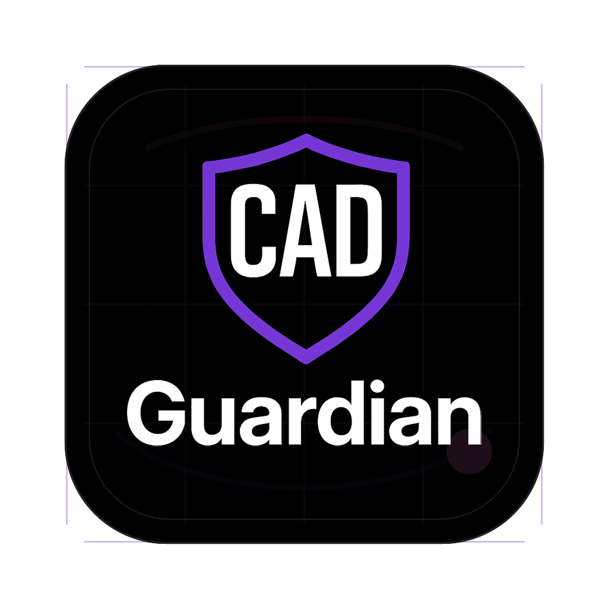

<p align="left">
  <a href="https://www.cadguardian.com/inventor-automation-consulting">
    
  </a>
</p>

# Inventor Automation and Drawing Output Public Runnable Evaluation Kit

Enterprise public evaluation kit for deciding whether an Autodesk Inventor automation engagement should start with package readiness, iProperty/BOM checks, drawing output, iLogic/VB.NET rules, or a native Inventor API/Vault handoff.

Canonical consulting path: [Inventor automation consulting](https://www.cadguardian.com/inventor-automation-consulting)

Live proof page: [GitHub Pages](https://tsmithcode.github.io/cadguardian-inventor-automation-proof/) | [Download ZIP](https://github.com/tsmithcode/cadguardian-inventor-automation-proof/archive/refs/heads/main.zip) | [CAD Guardian](https://www.cadguardian.com/) | [TSmithCode.ai](https://www.tsmithcode.ai/)

## CAD Guardian procurement fit

- Legal/procurement entity: CAD Guardian LLC, Delaware LLC.
- Primary classification: NAICS 541512 Computer Systems Design Services; SIC 7373 Computer Integrated Systems Design.
- Secondary implementation fit: NAICS 541511 Custom Computer Programming Services when the engagement includes custom software, API, desktop, reporting, or integration work.
- Public offer fit: Drawing/Document Automation Slice; Quote Automation Prototype; Implementation Build Slice.
- Canonical consulting path: [Inventor automation consulting](https://www.cadguardian.com/inventor-automation-consulting).
- Public runnable proof kit available; private customer artifacts are not exposed.
- GitHub social preview asset: `assets/github-social-preview.png` with SVG source at `assets/github-social-preview.svg`.

## Best for

- Manufacturing, drafting, and CAD automation teams that repeat Inventor model, iProperty, BOM, Content Center, and drawing-output checks.
- Evaluators who need public evidence before sharing private models, drawings, credentials, or Vault context.
- Technical reviewers deciding whether the first useful slice belongs in C#, iLogic/VB.NET, Inventor API code, or a Vault-connected workflow.

## Decision this proves

This repo proves whether the package contract is clear enough to justify native Inventor automation work.

Run it to answer:

- Are approved public IPT/STEP fixtures present and receipted?
- Are the first Pareto checks visible before document mutation begins?
- Are iProperty, BOM, Content Center, drawing output, and Vault handoff assumptions named?
- Is the boundary between public validation and licensed Inventor runtime work explicit?

## Run locally

```bash
npm run doctor
npm run verify
npm run demo
npm run quickstart:build
npm run sanitize
```

The package script names are intentionally unchanged. `npm run demo` runs the C# quickstart through `dotnet run --project quickstart`, and `npm run quickstart:build` runs the matching build gate.

## Expected output

`npm run demo` runs the C# quickstart and writes:

```text
reports/quickstart-report.json
```

The report includes fixture receipts, SHA-256 hashes, reusable routines, Pareto checks, API signals, and a status of `ready-for-private-sample` or `needs-review`.

## Proof boundary

This is a public runnable evaluation kit, not a production Inventor add-in. It validates the package-readiness layer that should exist before trusted CAD files are touched by native automation.

The proof shows:

- Public fixture inventory and receipts.
- iProperty and BOM readiness checks represented as explicit rules.
- Drawing output and `DrawingDocument` handoff vocabulary.
- Content Center and Vault assumptions called out before scope expands.
- Optional native examples for Inventor API, iLogic, and VB.NET conversations.

## What to send

For an evaluator review, send:

- This GitHub repo link.
- `reports/quickstart-report.json` after `npm run demo`.
- The canonical consulting page: [Inventor automation consulting](https://www.cadguardian.com/inventor-automation-consulting)
- One sentence naming the private product-family output you want automated next.

Do not send private drawings, credentials, raw opportunity notes, client names, or unapproved CAD fixtures in the public repo.

## Related CAD Guardian page

[Inventor automation consulting](https://www.cadguardian.com/inventor-automation-consulting)

Use that page for the buyer-facing service context. Use this repo for runnable proof that the engagement can start with a bounded package decision.

## Native runtime boundary

The default kit runs with local .NET and does not require licensed CAD software.

Native Inventor execution belongs inside the matching licensed CAD environment after this package boundary is proven. The handoff points are:

- `Inventor.Application`, `Document`, `PartDocument`, and `AssemblyDocument` for model package inventory.
- `PropertySets`, `BOM`, and `BOMView` for iProperty and BOM readiness.
- `DrawingDocument` and `Sheet` for drawing output.
- iLogic/VB.NET rule examples for model behavior close to the user workflow.
- Vault handoff only after ownership, release state, and package scope are clear.

## Public fixture boundary

Only approved public sample files are bundled:

- `fixtures/public/nist/INV_nist_ctc_01_asme1_2021.ipt`
- `fixtures/public/nist/nist_ctc_01_asme1_rd.stp`

No private names, credentials, private drawings, raw opportunity notes, client CAD files, license-uncertain assets, or unapproved CAD fixtures belong in this repository.
